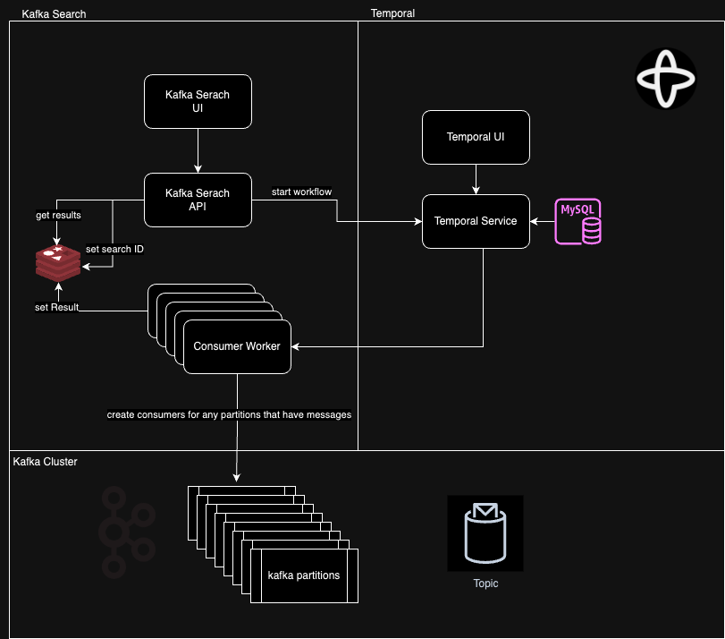

# Kafka Search Workflow

## Overview

KafkaSearchWorkflow is an advanced distributed system designed to perform efficient searches within a Kafka Topics, orchestrated by Temporal workflows. The system scales with Kafka's partitioned topics and facilitates consumer-based search operations and result management.



## Prerequisites

Ensure the following dependencies are installed:

- [Temporal Server](https://docs.temporal.io/docs/server/install) with UI
- [Python 3.7+](https://www.python.org/downloads/)
- [Poetry](https://python-poetry.org/docs/#installation)
- [Docker and Docker Compose](https://docs.docker.com/compose/install/)
- [Kafka with SASL authentication](https://kafka.apache.org/documentation/#security_sasl)

## Getting Started

1. Clone the repository:

    ```bash
    git clone https://github.com/yonathan-shtekel/topic-search-workflow
    cd KafkaSearchWorkflow
    ```

2. Install dependencies with Poetry:

    ```bash
    poetry install
    ```

3. Create a `.env_workflow` file in the root of the project with the following content:

    ```env
    SASL_USERNAME=username
    SASL_PASSWORD=password
    BOOTSTRAP_SERVERS=kafka-boostrap-servers:9093
    SCHEMA_REGISTRY_URL=https://avro-schema-registry.com
    REDIS_HOST=localhost
    REDIS_PORT=6379
    SEARCH_TIMEOUT_MINUTES=20
    TEMPORAL_URL=localhost:7233
    ```

    Adjust the values as needed for your local setup.

4. Start the Temporal server and Kafka cluster using Docker Compose:

    ```bash
    docker-compose up -d
    ```

5. Run the search worker to process Kafka messages:

    ```bash
    poetry run python apps/search_worker/run_worker.py
    ```

6. Start the search API server:

    ```bash
    poetry run python apps/search_api/server.py
    ```

## Starting a Kafka Search

To initiate a search, send a POST request to the search API with the necessary parameters.

### Endpoint

POST http://localhost:5001/api/v1/kafka-search/start

GET http://localhost:5001/api/v1/kafka-search/results/<search_id>

### Parameters

Include a JSON body with these start workflow fields:

- `topic`: The Kafka topic to be searched.
- `jq_query`: The jq query string for filtering messages.
- `key`: A unique identifier for the search operation.

### Example Request

Use `curl` to start a search:

```bash
curl -X POST "http://localhost/api/v1/kafka-search/start" \
     -H "Content-Type: application/json" \
     -d '{
           "topic": "your-kafka-topic",
           "jq_query": ".bilAddresses[] | select(.country == \"United States of America\") | .city",
           "key": 314234234234
         }'
```
Response
A successful request returns a search ID and status for tracking the search.

Project Structure
(Include the project structure as previously discussed)

Workflow Execution
(Include the workflow execution details as previously discussed)

Docker and Services
(Include the Docker and services details as previously discussed)

Configuration
Configuration parameters are managed using the .env_workflow file for local setup. Modify the .env_workflow file to match the specifics of your Kafka and Temporal setup.

License
Distributed under the MIT License. See LICENSE for more information.

